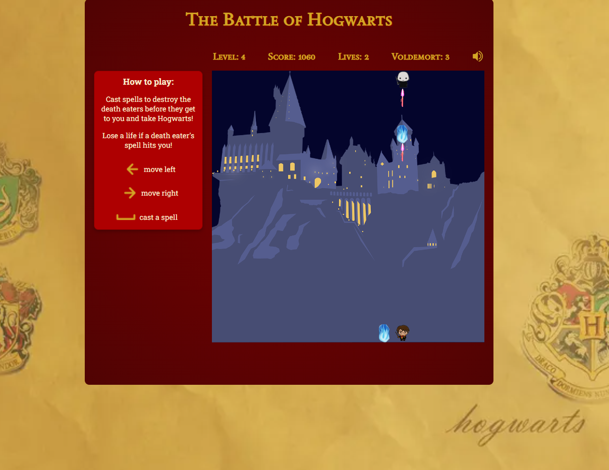

# Project 1 - The Battle of Hogwarts

## Overview

For the first project of the General Assembly Software Engineering Course, I created a game called "The Battle of Hogwarts" which is based on "Space Invaders" but with a Harry Potter theme.

## Description of the Game

The player is Harry Potter and he has to cast spells ("lasers") at the death eaters ("space invaders") before they reach the end of the grid. The player moves using the left and right arrow keys and casts spells using the space bar. The death eaters move across and down the screen. A random death eater periodically cast spells ("bombs") down the grid. The player loses a life if hit by a spell. 

There are three main levels of the game, and in each level the death eaters' speed increases.

In the fourth and final level, Voldemort appears. Each second, he moves randomly in the grid and casts a spell. Voldemort has 3 lives and the player must hit him 3 times to win the game.

## Deployed Game

[Play the deployed version of the game here](https://kamlasm.github.io/space-invaders/) 

## Game Setup 

The game display is setup as a grid using CSS Flexbox made up of 15x15 divs.  

The movement of the characters and spells is achieved by grabbing the grid divs in the DOM and then adding and removing classes to the relevant divs using a combination of Javascript and CSS.

To enable the death eaters' movement, I created an interval timer which called the function below to determine what the next movement should be. I defined an invaderMoveCounter which kept track of the total moves made. Every 7 moves, the death eaters' move down the grid (i.e. the whole width of the grid) and their direction is reversed.

```JS
let invaderMoveCounter = 1
let invaderMoveDirection = 1
const width = 15

function moveInvaders() {
    let invaderMove = 0
    if (!gameOver) {
        if (invaderMoveCounter % 7 !== 0) {
            invaderMove = invaderMoveDirection
        } else if (invaderMoveCounter % 7 === 0) {
            invaderMove = width
            invaderMoveDirection = invaderMoveDirection * -1
        }
        invaderMoveCounter++

        updateInvaderIdx(invaderMove)
    }
}
```
The trickiest part of the game setup was the player's spells. I created a function (below) so that each time the player presses the space bar to shoot a spell, a new variable called laserIdx is defined and a new interval timer is created to enable each spell to move up the grid. The laserIdx had to be defined locally as I wanted to create a new laserIdx each time, not update the current one, in order to have multiple spells in play at once.

Depending on which level the player is on, the function then calls another function each time the laser moves to check whether it has collided with a death eater/Voldemort. 

```JS
function playerShoots() {
    let laserIdx = playerIdx - width
    let hit = false
    harryAudioPlayer.play()

    let laserTimer = setInterval(() => {
        cells[laserIdx].classList.remove("lasers")

        if (laserIdx > 15 && !gameOver) {
            laserIdx -= width
            cells[laserIdx].classList.add("lasers")

            if (level === finalLevel) {
                playerHitsVoldy(laserIdx, laserTimer)
            } else {
                playerHitsInvaders(laserIdx, laserTimer, hit)
              }

        } else if (gameOver) {
            cells[laserIdx].classList.remove("lasers")
            clearInterval(laserTimer)
        }
    }, 200)
}
```
## Additional Features

Once I had the initial gameplay setup, I added audio including sound effects for the spells, background game music and sound effects on winning or losing the game. I created separate audio elements in the HTML so that the sounds could play simultaneously. 

I also added a landing page, which I styled as the "Marauders' Map" from Harry Potter with the player having to click on a pulsing button to open up the game.

I added a final level of the game with Voldemort appearing and moving randomly as I thought this would be a fun and surprising challenge after completing the other "normal" levels of the game. I created an interval time which called the function below every second to move Voldemort. His movement is determined by generating a random index in the grid.

```Javascript
function moveVoldemort() {
    cells[voldyIdx].classList.remove("voldemort")
    randomVoldyIdx = Math.floor(Math.random() * cells.length)
    voldyIdx = randomVoldyIdx
    cells[voldyIdx].classList.add("voldemort")

    voldemortShoots()
}
```

## Displays from the Game

The landing page


The initial game display


The first level of the game in action


The last level of the game with Voldemort



The message and image displayed on losing the game


## Technologies Used

- Javascript
- HTML
- CSS

## Attributions

- Wallpaper by grand from [Wallpapers.com](https://wallpapers.com/wallpapers/hogwarts-house-logos-harry-potter-desktop-dyqtgu9zpr30a5eb.html)

- Hogwarts background by movprint from [Pixabay](https://pixabay.com/illustrations/hogwarts-harry-potter-magic-school-3476786/)

- Icons for keys and sound/mute from [IconScout](https://iconscout.com/)

- Sound effects from [Pixabay](https://pixabay.com/sound-effects/?utm_source=link-attribution&utm_medium=referral&utm_campaign=music&utm_content=105518) and [Myinstants](https://www.myinstants.com/en/index/gb/)

## Future Improvements

 - Add responsiveness.
 - Store high scores using localStorage. 