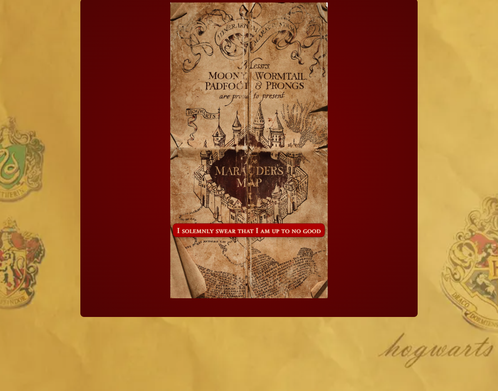

# Project 1 - The Battle of Hogwarts

## Overview

I created a game called "The Battle of Hogwarts" which is based on "Space Invaders" but with a Harry Potter theme.

## Description of the Game

## Deployed Game

[Play the deployed version of the game](https://kamlasm.github.io/space-invaders/) 

## Displays from the Game

Landing page

Initial game display

The game in action

The last level of the game

Win display

## Technologies Used

- Javascript
- HTML
- CSS

## Attributions

[Wallpaper by grand from Wallpapers.com]("https://wallpapers.com/wallpapers/hogwarts-house-logos-harry-potter-desktop-dyqtgu9zpr30a5eb.html")

## Future Improvements

 - Store high scores using localStorage. 